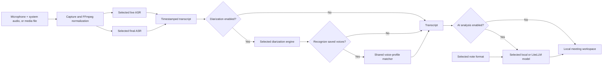

<div align="center">
  
  <h1>Meet2Notes</h1>
  <p><strong>Private AI meeting notes, local transcription, and speaker diarization.</strong></p>
  <p>Record, transcribe, identify speakers, and create structured meeting summaries on your own computer.</p>

  <p>
    <a href="https://meet2notes.eu"><strong>Website</strong></a> ·
    <a href="#installation">Install</a> ·
    <a href="docs/README.md">Documentation</a> ·
    <a href="https://github.com/estebanstifli/Meet2Notes/issues">Support</a>
  </p>

  <p>
    
    
    
    
    
  </p>
</div>

Meet2Notes is an open-source, self-hosted AI meeting assistant for Windows,
macOS, and Linux. It captures microphone and system audio, imports recordings,
creates live or high-quality final transcripts, separates and recognizes
speakers, and turns conversations into searchable, structured meeting notes.
It is designed for private local AI workflows: recordings, transcripts, model
files, and application data remain under the user's control.

For video calls, select **Microphone + System audio** together to record both
sides of the conversation. See the [audio capture setup guide](docs/audio-capture.md)
for Windows loopback, Linux monitors, and macOS virtual inputs.

Meet2Notes is a private, local-first alternative to commercial AI meeting
assistants such as **Granola**, **Fireflies.ai**, **Fathom**, and **Otter.ai**.
It is also an open-source alternative to **Meetily** for people and teams that
want self-hosted meeting transcription, speaker diarization, and AI notes
without surrendering control of their recordings.

The official product website is [meet2notes.eu](https://meet2notes.eu).

The processing pipeline is intentionally modular. Transcription, diarization,
saved-voice matching, and analysis are independent stages with their own model
selection, settings, lifecycle, and worker. A meeting is not tied to Faster
Whisper, Sherpa-ONNX, or a particular language model.

> Meet2Notes is in active alpha development. Back up important recordings and
> obtain every consent required before recording a conversation.

## Meet2Notes 0.6: the complete meeting, available to your AI

Version 0.6.1 can record **Microphone + System audio** simultaneously, capturing
your voice and the other participants in one synchronized local recording. Each
input has its own device selector and live meter; the mixed audio feeds both live
transcription and the final WAV while preserving headroom when people speak at
the same time. Windows uses native WASAPI loopback, while the setup guide explains
the virtual or monitor inputs used on macOS and Linux.

The 0.6 series also turns Meet2Notes into a private knowledge source for the desktop
AI tools people already use. Its local **Model Context Protocol (MCP)**
server connects **Claude Desktop, ChatGPT Desktop, Codex**, and compatible MCP
clients to completed meetings without copying the Meet2Notes database or
introducing another cloud service.

Instead of manually finding and pasting old transcripts, users can ask their AI
client to locate a meeting, inspect its metadata, read the relevant transcript
or AI notes, and retrieve grounded evidence across the meeting library. This
makes previous conversations useful in the next proposal, status report,
decision review, customer follow-up, or project handover while the source data
remains under the user's control.

| What the user can do | Why it matters |
|---|---|
| Ask which meeting discussed a person, project, decision, date, or identifier | Turns a growing archive into useful organizational memory |
| Read a transcript or AI notes from Claude Desktop, ChatGPT Desktop, or Codex | Removes the repeated search-and-copy workflow |
| Search exact terms with local FTS5 or concepts with hybrid RAG | Covers both precise facts and meaning-based discovery |
| Follow meeting IDs, timestamps, speakers, and source excerpts | Keeps answers traceable to the original conversation |
| Disable MCP access at any time from Settings | Gives the user an explicit local privacy control |

Technically, every desktop client starts a lightweight `stdio` MCP process from
the existing Meet2Notes virtual environment. That process talks only to the
running application's bounded read API; it does not open `app.db`, load a second
copy of the AI models, rebuild the RAG index, or expose recording, editing,
deletion, settings, audio, or filesystem tools. Loopback is enforced by default,
and multiple clients can safely use the same running Meet2Notes instance.

Configuration snippets and their destination paths are generated in
**Settings -> General -> MCP desktop clients**, ready to copy for Claude Desktop
or for Codex/ChatGPT Desktop. See the [Local MCP server guide](docs/mcp.md) for
setup, tools, lifecycle, and security details.

## Current features

- Live recording from microphones, audio interfaces, Windows WASAPI loopback,
  and the inputs exposed by macOS or Linux.
- WAV, MP3, M4A, FLAC, OGG, AAC, MP4, MKV, WebM, and MOV import through FFmpeg.
- Separate selectable engines for live and final transcription.
- Optional final quality pass, speaker diarization, saved-voice recognition,
  and AI analysis; each step can be enabled or disabled before processing.
- Automatic speaker count or an explicit known count without using magic
  values such as `-1` in the user interface.
- Timestamped transcription segments and diarized speaker turns stored in a
  local SQLite workspace.
- Historical RAG over one meeting or the full library, with BGE-M3 embeddings,
  persisted SQLite vectors, optional sqlite-vec acceleration, hybrid ranking,
  temporal queries, and timestamped source provenance.
- A read-only local MCP server that lets Claude Desktop, ChatGPT Desktop, Codex,
  and compatible clients query meetings, transcripts, AI notes, exact keyword
  matches, and existing hybrid RAG evidence with source provenance.
- A separate Prompt window that can use a complete selected transcript or embed
  each question and retrieve grounded context from every meeting.
- A native Live AI Assistant that watches provisional transcript segments,
  follows user-defined monitoring rules, and publishes concise insights through
  its own bounded queue and independent local or LiteLLM worker.
- Durable outbound webhooks for Live segments and processing milestones, with
  per-endpoint content controls, HMAC signatures, retries, delivery history, and
  optional remote-agent suggestions that never block local transcription.
- A Speakers workspace for renaming speakers, saving voice samples, matching
  identities across meetings, generating per-speaker summaries, and exporting
  a speaker's text or audio.
- A meeting library, live job progress, cancellation, diagnostic logs, light
  and dark themes, and a safe application shutdown button. Permanent meeting
  deletion asks for confirmation and removes that meeting's audio, transcript,
  notes, Live Assistant data, RAG index entries, jobs, and private files.
- A Local AI Status panel showing engine state, model residency, system RAM,
  GPU name, VRAM when available, and the Meet2Notes GPU process.
- Model tables in Settings with installed state, download size, selection,
  install, load, unload, and uninstall actions where supported.
- Basic settings tailored to the selected model and separate advanced controls.
- Optional preload at startup. Models remain resident after use until they are
  unloaded, replaced, or the application shuts down.

## Demo

<p align="center">
  <a href="https://youtu.be/Z2wRrs9Q9pU">
    
  </a>
</p>

<p align="center"><a href="https://youtu.be/Z2wRrs9Q9pU">Watch the Meet2Notes presentation and demo on YouTube</a></p>

<a id="installation"></a>

## Easy installation

### Windows: download and run one file

1. Download [`install-update.bat`](https://github.com/estebanstifli/Meet2Notes/raw/main/install-update.bat).
2. Double-click the downloaded file.
3. Wait for setup to finish, then open the new `Meet2Notes` folder and
   double-click `start.bat`.
4. Open `http://127.0.0.1:8765` in your browser.

The bootstrap installer checks for Git and Python 3.11 or newer, installs
missing prerequisites for the current Windows user, clones Meet2Notes, and
runs the normal isolated-environment installer. On an existing installation it
delegates to the safe stable-Release updater. It does not install Python
packages globally.

The installation folder is deterministic: the installer creates a
`Meet2Notes` folder beside the downloaded `.bat`. For example, a file saved as
`C:\Users\Name\Downloads\install-update.bat` installs the application in
`C:\Users\Name\Downloads\Meet2Notes`. Move the `.bat` to another writable
folder before running it if you want the application installed elsewhere.
Re-running the same file checks for a newer stable Release. `update.bat` can be
run directly for the same purpose.

> Windows may show a SmartScreen warning because this open-source batch file is
> not code-signed. Review its contents before running it and download it only
> from the official Meet2Notes repository or [meet2notes.eu](https://meet2notes.eu).

### Pinokio: one-click local installation

Meet2Notes can also be installed through [Pinokio](https://pinokio.computer),
which keeps the application, Python runtime, FFmpeg, dependencies, and
recommended local models in its isolated application environment.

1. In Pinokio, choose the option to install an app from a Git repository.
2. Enter `https://github.com/estebanstifli/Meet2Notes.git`.
3. Select **Install Meet2Notes**, wait for the model downloads to finish, then
   select **Start Meet2Notes**.
4. Use **Open Meet2Notes** in Pinokio to open the local web interface.

The Pinokio menu also provides **Update** and **Repair installation**. Repair
recreates only Pinokio's private runtime; meeting data and downloaded models
remain managed by Meet2Notes and are not removed automatically.

### macOS and Linux

```bash
git clone https://github.com/estebanstifli/Meet2Notes.git
cd Meet2Notes
chmod +x install.sh
./install.sh --ai-backend cpu
.venv/bin/meet2notes --no-browser
```

Python 3.11 or newer must already be installed on macOS and Linux. For CUDA,
custom model storage, and backend-specific setup, continue to the
[advanced installation options](#advanced-installation-from-source).

## Modular processing pipeline



Every inference adapter owns a dedicated executor or isolated worker. Heavy
model work does not run on FastAPI's event loop, and engines can be prepared,
loaded, unloaded, or replaced independently. This is the extension point for
adding more built-in or custom engines without changing the meeting workflow.

Webhook network delivery is similarly isolated from capture and inference. See
the [webhook integration guide](docs/webhooks.md) for events, payloads,
signatures, privacy controls and the Live-agent response contract.

## Engine catalog

### Transcription

Live and final transcription have independent selections. The current catalog
contains:

| Engine/model | Download | CPU | CUDA | Live | Final |
|---|---:|:---:|:---:|:---:|:---:|
| Faster Whisper Tiny | 78.2 MB | Yes | Yes | Yes | Yes |
| Faster Whisper Base | 148 MB | Yes | Yes | Yes | Yes |
| Faster Whisper Small | 486 MB | Yes | Yes | Yes | Yes |
| Faster Whisper Medium | 1.53 GB | Yes | Yes | Yes | Yes |
| Faster Whisper Large v3 | 3.09 GB | Yes | Yes | Yes | Yes |
| Faster Whisper Distil Large v3 | 1.52 GB | Yes | Yes | No | Yes |
| Faster Whisper Large v3 Turbo | 1.62 GB | Yes | Yes | No | Yes |
| NVIDIA Nemotron 3.5 ASR Streaming 0.6B | ~2.6 GB | Supported by runtime | Recommended | Yes | Yes |
| NVIDIA Parakeet TDT 0.6B v3 | ~2.6 GB | Supported by runtime | Recommended | No | Yes |
| Microsoft VibeVoice ASR BitNet | 1.58 GB | Yes | No | No | Yes |

Faster Whisper defaults to `small` and supports automatic language detection,
an explicit language such as Spanish, word timestamps, VAD, beam search,
compute type, CPU thread count, worker count, and live window overlap.
Distil Large v3 is English-only. The experimental VibeVoice BitNet runtime is
CPU-only and Spanish is not in Microsoft's currently validated language list.
The unsupported VibeVoice ASR 7B model is not exposed in the catalog.

NVIDIA models are optional and never downloaded by the default installation.
Their official support matrix focuses on Linux, although the application checks
the installed Windows runtime and reports actual readiness.

### Speaker diarization

Sherpa-ONNX is the default. The Settings -> Speakers table also exposes the
optional alternatives:

| Engine | Device | Installation and use |
|---|---|---|
| Sherpa-ONNX | CPU, CUDA, CoreML when available | Lightweight default using local Pyannote segmentation and 3D-Speaker models |
| Pyannote Community-1 | CPU or CUDA | Higher-accuracy gated Hugging Face model with exclusive diarization support |
| `diarize` | CPU only | Runs in a private child virtual environment to avoid dependency conflicts |

The basic options are speaker count (automatic or known), supported execution
device, preload on startup, and saved-voice recognition. Thresholds, clustering,
segmentation, batching, and provider-specific parameters live under Advanced.

Saved-voice matching is a separate shared component, not part of a diarizer.
Consequently, existing WAV profiles can be matched after Sherpa-ONNX,
Pyannote, or `diarize` produces the speaker turns.

Pyannote Community-1 requires accepting the conditions on its
[Hugging Face model page](https://huggingface.co/pyannote/speaker-diarization-community-1).
Create a read token, add it to `.env`, restart Meet2Notes, and install the model
from Settings:

```dotenv
M2N_PYANNOTE_TOKEN=hf_your_read_token_here
```

Pyannote telemetry is disabled by default, and the token is not written to the
application database.

### AI analysis

The AI engine is independent of transcription and diarization. The managed
local catalog uses llama.cpp:

| Model | Approx. download | Notes |
|---|---:|---|
| LFM2.5 1.2B Q4 | 731 MB | Recommended private local default |
| Qwen3 0.6B Q8 | 639 MB | Smallest multilingual local option |
| Qwen3 1.7B Q8 | 1.83 GB | Higher-quality multilingual local option |
| Custom GGUF | User-provided | Loads an existing compatible GGUF selected with the file picker |
| Custom local / remote via LiteLLM | No managed download | Connects Ollama, LM Studio, OpenAI-compatible endpoints, or another LiteLLM provider |

Custom GGUF files remain owned by the user: selecting or removing a profile
does not delete the external file. Model path, context size, GPU layers,
threads, batch size, sampling, and generation limits are configurable. LiteLLM
profiles expose the model identifier, URL/base URL, and provider options.

LiteLLM API keys are stored through the operating system keyring (Windows
Credential Manager on Windows), not in SQLite or browser storage. The UI stores
only whether a secret is configured. Environment-based provider credentials
remain available when supported by LiteLLM.

### Live AI Assistant

Settings -> Live Assistant configures an optional native assistant for active
meetings. It has its own model selection, API-key vault entry, monitoring
instructions, trigger phrases, rolling context, compact memory, cooldown, rate
limit, and request timeout. Its model does not have to match the AI Notes model.
Responses appear in a movable, resizable, and minimizable floating meeting
widget so they remain visible without changing the transcript layout. Insights
are accumulated chronologically while the assistant continues listening; they
do not require manual accept or dismiss actions.

Capture publishes committed Live segments with a non-blocking `put_nowait` into
a bounded in-memory queue. A separate dispatcher coalesces updates and invokes a
dedicated inference engine; recording and transcription never wait for the
assistant. A separate local model runtime still consumes additional RAM/VRAM and
can contend for the same physical CPU or GPU, so the feature is disabled by
default. See the [Live AI Assistant guide](docs/live-ai-assistant.md).

## Note formats

Settings -> Note formats controls how the selected AI model turns a transcript
into structured Markdown. Formats do not alter the recording, transcript, or
speaker turns. A format defines a name, description, overall instructions, and
an ordered set of sections. Each section has a title, an instruction, an output
type (`paragraph`, `list`, or `text`), and an optional Markdown item format.

Nine built-in formats are included:

- General Meeting (default)
- Daily Stand-up
- Project Sync
- Sales Call
- Technical Meeting
- Interview
- Lecture Notes
- Brainstorming
- Formal Minutes

Users can create custom formats, duplicate a built-in format, edit or delete
custom formats, and choose any format as the default. Each summary records both
the selected format ID and an immutable snapshot of its prompt and sections, so
old results remain reproducible after a format is edited.

Completed AI notes can be edited as Markdown directly from the meeting's AI
Notes tab. The first generated version and manual-edit timestamp remain in the
summary metadata. **Rebuild AI notes** creates a new version from the active
transcript, asks for a Note Format with the Settings default preselected, and
keeps prior successful, failed, or manually edited versions in local history.
The compact header actions also copy the complete report and save edits without
adding another toolbar row. Meet2Notes warns before unsaved edits are discarded
when changing sections, following an internal link, refreshing, or closing the
page.

Long transcripts are handled automatically with hierarchical AI notes. The
summary worker estimates the prompt against the configured context window,
splits oversized meetings at transcript-line boundaries, extracts grounded
evidence from every block, recursively consolidates those reports, and only
then applies the selected Note Format. The finishing dialog shows the estimated
input size and block count before processing starts; short meetings continue to
use the faster single-pass path.

## Historical RAG and Prompt

Settings -> RAG provides three embedding choices: managed BGE-M3 through
FastEmbed/ONNX Runtime, a custom local GGUF file through llama.cpp, and a custom
local or remote endpoint through LiteLLM. Basic and advanced settings adapt to
the selected profile, and RAG can be disabled independently. SQLite is the
default vector store; plugins can register alternative vector-store backends
through the public RAG hooks.

Rebuilding the historical index requires explicit confirmation and runs as a
persistent local job. Its progress dialog reports each meeting and embedding
batch without blocking the Settings request.

The post-meeting Meeting Assistant is available from the meeting library and every
completed meeting. It uses local RAG by default, combines dense retrieval with
SQLite FTS5/BM25 through Reciprocal Rank Fusion, and narrows all-history searches to
a relevant meeting shortlist before retrieving transcript evidence. For a selected
meeting, completed transcript versions and AI-note versions can also be attached as
raw context; the widget reports an estimated token budget and prevents oversized
attachments from silently triggering expensive multi-pass processing. The legacy
Prompt page remains available for compatibility.

## Desktop AI clients through MCP

Meet2Notes includes a read-only local MCP server for Claude Desktop, ChatGPT
Desktop, Codex, VS Code, Cursor, and other clients that support `stdio`. Each
client launches the Python module from the existing Meet2Notes virtual
environment; no separate executable is distributed. The lightweight MCP
processes all connect to the one running Meet2Notes instance, which remains the
owner of the database, RAG index, and AI models.

Available tools list meetings, read bounded transcript pages and completed AI
notes, perform fast keyword search, and retrieve existing hybrid RAG evidence.
Every result remains tied to its meeting and source context. The MCP integration
never starts indexing or exposes capture, audio, settings, edits, or deletion
operations. Meet2Notes also generates the exact Claude Desktop JSON and
Codex/ChatGPT Desktop TOML snippets from Settings, including the correct local
Python path. See [Local MCP server](docs/mcp.md) for Windows, Linux, and macOS
configuration examples.

## Help translate Meet2Notes

Meet2Notes welcomes community-maintained UI localizations. The source catalogue
is [`src/local_meeting_ai/web/static/locales/en.json`](src/local_meeting_ai/web/static/locales/en.json);
each language has a matching JSON catalogue in the same folder and is listed in
[`index.json`](src/local_meeting_ai/web/static/locales/index.json).

To add a language, copy `en.json` to its locale code (for example, `fr.json`),
translate its values, add the language's native name to `index.json`, and open a
pull request. If you would prefer to coordinate first, open a GitHub issue with
the proposed locale and we can reserve or review it there.

AI can be useful for a first draft, but it is not a substitute for native
review. We deliberately rely on native-speaking contributors to make wording,
tone, and product terminology feel right in their language. Pull requests from
translators are very welcome.

Before submitting a localization, run:

```powershell
.\.venv\Scripts\python.exe scripts\check_ui_i18n.py
```

The check verifies catalogue completeness and preserves product and technical
terms such as Meet2Notes, RAG, Faster Whisper, Word, and Markdown.

## Community plugins

The post-recording pipeline exposes a versioned Python Plugin API with
WordPress-inspired actions and filters. Community packages can observe final
transcription, diarization, analysis, and pipeline lifecycle events or transform
the temporary document sent to AI. Translation, redaction, terminology,
enrichment and alternative RAG vector stores can therefore be added
without altering core capture code. The shared provider registry
also accepts transcription, diarization, summary, and embedding engines, models
for an existing engine, declarative settings, and composite ASR results containing
speaker turns.

Plugins are discovered through the standard `meet2notes.plugins` package entry
point and managed from Settings -> Plugins. Hook executions have priorities,
timeouts, failure policies, and a privacy-preserving provenance ledger. The
canonical recording and transcript are never overwritten by a filter.

Each community plugin is developed and released from its author's own
repository. Authors do not need to merge plugin code into Meet2Notes: when it is
ready, they may open a **Community plugin listing** issue with its public URL,
installation source, compatibility, permissions, and test results. Maintainers
may then add it to [community-plugins.json](community-plugins.json). Listing is
discretionary and is not a security audit or endorsement.

The catalog is currently an informational JSON file; Meet2Notes does not fetch
or install entries automatically. A user chooses a listed plugin, reviews its
repository, and installs it explicitly into the private environment, for
example:

```powershell
.\.venv\Scripts\python.exe -m pip install package-name
```

Then open Settings -> Plugins, rescan installed packages, review the requested
permissions, and enable it. See the [Plugin API and installation guide](docs/plugins.md),
[plugin/provider development guide](docs/plugin-development.md),
[documentation index](docs/README.md), and [public roadmap](docs/roadmap.md).

## Advanced installation from source

The installers create an isolated `.venv` inside the repository. Meet2Notes
does not install packages into the global Python environment. Python 3.11 or
newer is required; Python 3.12 is recommended for the broadest CUDA wheel
compatibility. FFmpeg is installed automatically when the platform package
manager permits it.

Clone the repository first:

```powershell
git clone https://github.com/estebanstifli/Meet2Notes.git
cd Meet2Notes
```

### CPU-only installation

Windows PowerShell:

```powershell
Set-ExecutionPolicy -Scope Process Bypass
.\install.ps1 -AiBackend cpu
.\start.bat
```

macOS or Linux:

```bash
chmod +x install.sh
./install.sh --ai-backend cpu
.venv/bin/meet2notes --no-browser
```

### NVIDIA CUDA installation

Use this installation on Windows or Linux when a compatible NVIDIA driver is
present. CUDA-enabled PyTorch and compatible packages are installed only in
`.venv`; a system-wide CUDA toolkit is not required.

Windows PowerShell:

```powershell
Set-ExecutionPolicy -Scope Process Bypass
.\install.ps1 -AiBackend cuda
.\start.bat
```

Linux:

```bash
./install.sh --ai-backend cuda
.venv/bin/meet2notes --no-browser
```

If Meet2Notes was initially installed in CPU mode and the user later selects a
CUDA-only configuration, Settings detects the mismatch. A confirmation dialog
explains the change and a progress dialog streams the package installation log
while the CUDA PyTorch runtime is installed into `.venv`. Restart the
application after the upgrade.

Useful installer options:

```powershell
# Runtime without downloading the recommended model set
.\install.ps1 -AiBackend cpu -Models none

# Development dependencies
.\install.ps1 -Dev -Models none

# Keep large model files on another disk
.\install.ps1 -ModelsDirectory "D:\Meet2Notes\Models"
```

Equivalent Unix options are `--no-models`, `--dev`, and
`--models-dir /path/to/models`.

## Start and stop

On Windows, double-click `start.bat` or run it from CMD or PowerShell. It does
not open a browser. The same console reports configured model preload results
before the server announces its local address:

```text
http://127.0.0.1:8765
```

Open that address manually. The console remains open after a normal exit or an
error so its last messages can be read. To stop safely, use the power button in
the Local AI Status card or press `Ctrl+C` in the console. The normal shutdown
path stops capture and jobs, unloads the models, releases CUDA memory, shuts
down workers, and then terminates Python. Closing only the browser tab does not
stop the local server because a tab cannot reliably own a background process.

Direct launch and diagnostics:

```powershell
.\.venv\Scripts\python.exe -m local_meeting_ai --no-browser
.\.venv\Scripts\meet2notes.exe --help
```

Meet2Notes binds to `127.0.0.1` by default and is not exposed to the network
unless the host setting is changed explicitly. A single-instance lock prevents
accidentally starting two servers against the same data directory.

### Safe stable updates

Before starting the server, `start.bat` checks at most once every 24 hours for
a newer stable GitHub Release. If one exists, the user can accept it or defer
the notification. `update.bat` provides the same check manually.

The updater never follows arbitrary commits from `main`. It accepts only
`vX.Y.Z` tags from the official repository, requires a clean Git checkout and
a stopped application, and creates a consistent SQLite backup before changing
the source. Settings, meetings, recordings, summaries, RAG data, models, and
custom storage locations are preserved. New settings parameters receive their
new defaults without overwriting stored values. See [Safe updates](docs/updating.md)
for the complete transaction and recovery model.

## Model installation and storage

The default installer downloads Faster Whisper Small, Sherpa-ONNX diarization,
the shared saved-voice embedding model, and LFM2.5 1.2B Q4. Historical RAG selects
BGE-M3 by default and installs it directly through FastEmbed/ONNX Runtime without
Ollama or PyTorch. Other catalog entries are opt-in.
Models are reused between sessions and are separate from recordings and the SQLite
database.

The Settings tables are the preferred management interface. Command-line model
setup is also available:

```powershell
.\.venv\Scripts\meet2notes-models.exe --models all
.\.venv\Scripts\meet2notes-models.exe --models whisper --whisper-model medium
.\.venv\Scripts\meet2notes-models.exe --models diarization summary
.\.venv\Scripts\meet2notes-models.exe --models embeddings
.\.venv\Scripts\meet2notes-models.exe --models nvidia-parakeet
.\.venv\Scripts\meet2notes-models.exe --models nvidia-nemotron
```

Application data defaults to `data/` and model weights to `models/` inside the
installation. Both can be moved independently from Settings -> General -> Data
storage locations. The selected locations are activated safely on the next
start. They can also be overridden with `M2N_DATA_DIR`, `M2N_MODELS_DIR`,
`--data-dir`, or `--models-dir`.

## Recording and post-processing

After stopping a recording or importing a media file, Meet2Notes presents the
processing choices before starting expensive work:

1. Run or skip speaker diarization.
2. Detect the number of speakers automatically or provide the known count.
3. Run or skip the selected final transcription pass.
4. Run or skip AI analysis using the selected note format.

The processing dialog includes a live text log as well as progress. Each job
records timestamps and intermediate stages. A failure in an optional stage is
reported without coupling the remaining engines to that implementation.

## Privacy and local data

- Recordings, transcripts, speaker turns, summaries, preferences, and job state
  are stored locally.
- There is no telemetry and no automatic cloud upload.
- Local engines do not require an Internet connection after their packages and
  weights are installed.
- Network access occurs for the short cached GitHub Release check, an explicit
  update or model download, or when the user selects a remote LiteLLM provider.
  The update check sends no meeting data or telemetry.
- Provider secrets use the OS keyring; the Pyannote download token is read from
  `.env` or the process environment.
- `.env`, databases, recordings, model weights, logs, benchmarks, local path
  overrides, and UI test workspaces are excluded from version control.

See [Privacy](docs/privacy.md) for the threat model and storage details.

## ASR evaluator

`scripts/evaluate_asr.py` benchmarks installed ASR engines outside the unit test
suite. It uses a separate Python process and an orchestration thread, unloads
the model before and after every pass, and never downloads missing engines.

```powershell
.\.venv\Scripts\python.exe scripts\evaluate_asr.py --input debate_ceuta.wav
```

For every selected engine and input it attempts four cold passes: CPU with
automatic language detection, CPU with Spanish, CUDA with automatic detection,
and CUDA with Spanish. Permanent results are written to
`<data-dir>/benchmarks/asr`:

- A timestamped JSON run with start/end times, load, inference, unload and
  intermediate progress timings, effective configuration, errors, and the
  complete transcript text.
- `asr-evaluations.json`, an append-only comparison ledger.

Use `--profile <ids...>`, `--input <files...>`, or `--results-dir <folder>` to
limit or relocate a run. Unsupported devices and missing models are retained as
explicitly skipped passes rather than disappearing from the comparison.

## Diarization evaluator

`scripts/evaluate_diarization.py` benchmarks the installed diarization engines
without starting the web application. It performs one cold CPU pass and one
cold CUDA pass per selected engine when supported, using a separate process and
orchestration thread.

```powershell
.\.venv\Scripts\python.exe scripts\evaluate_diarization.py --input debate_ceuta.wav
```

The input is normalized once to 16 kHz mono WAV. Results under
`<data-dir>/benchmarks/diarization` include load, diarization, unload, start/end,
and intermediate progress timings; the effective configuration; detected
speaker statistics; every speaker segment; a readable timeline per pass; and
the append-only `diarization-evaluations.json` ledger. Missing runtimes, tokens,
or CUDA support are recorded explicitly. Use `--engines sherpa-onnx pyannote-community-1`
to limit a run and `--num-speakers 2` only when the count is known.

## Development

```powershell
.\install.ps1 -Dev -Models none
.\.venv\Scripts\ruff.exe check .
.\.venv\Scripts\mypy.exe src
.\.venv\Scripts\python.exe -m pytest
```

On macOS or Linux, use `./install.sh --dev --no-models`. The repository includes
database migrations, API/integration/unit tests, model lifecycle tests,
timestamp normalization tests, and multi-platform GitHub Actions checks for
Python 3.11 and 3.13.

The main boundaries are:

- `adapters/`: capture, transcription, diarization, voice matching, summaries,
  model files, and credential storage.
- `application/`: orchestration, engine settings, speaker services, note formats,
  and job workflows.
- `infrastructure/`: SQLite repositories, migrations, FFmpeg, storage, model
  installation, job execution, CUDA setup, and instance locking.
- `api/`: versioned request/response schemas and local HTTP endpoints.
- `web/`: server-rendered pages plus the browser UI.

Start with the [documentation index](docs/README.md). Read
[Architecture](docs/architecture.md), [Contributing](CONTRIBUTING.md), and the
[Roadmap](docs/roadmap.md) before extending an engine or submitting core changes.

## Platform support

| Capability | Windows | macOS | Linux |
|---|---|---|---|
| Microphone/audio interface | WASAPI | CoreAudio input | PipeWire/Pulse/ALSA input |
| Desktop audio | WASAPI loopback | Virtual/tap-backed input* | Monitor input* |
| Faster Whisper CPU | Yes | Yes | Yes |
| Faster Whisper CUDA | NVIDIA | No | NVIDIA |
| llama.cpp acceleration | CUDA or CPU | Metal or CPU | CUDA or CPU |

\* Availability depends on the source exposed by the operating system.

## License

Meet2Notes is released under the [MIT License](LICENSE).
